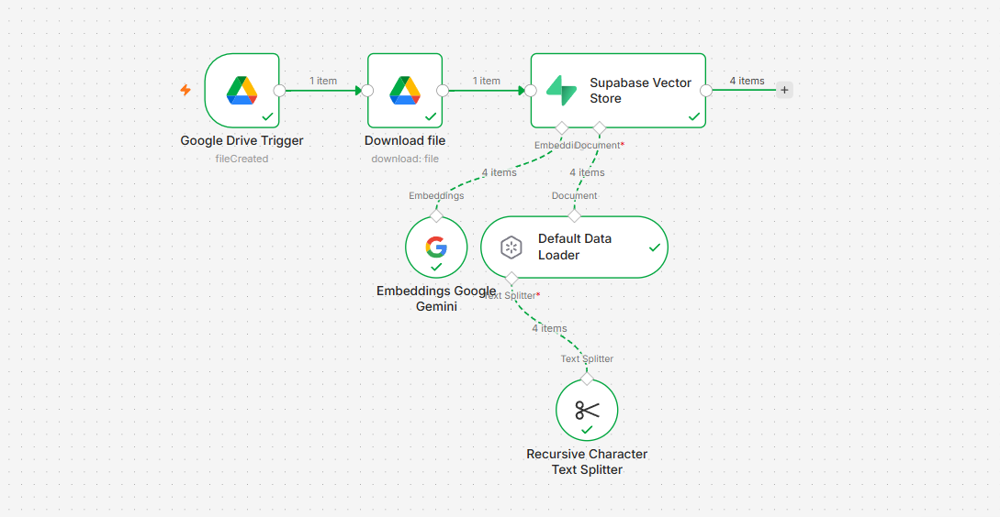

# 🤖 DocBot — RAG Chatbot System

A full **Retrieval-Augmented Generation (RAG)** chatbot system that lets users upload documents and ask questions about them. Built entirely on a **free stack** using n8n, Supabase (pgvector), Google Gemini embeddings, and Groq LLM.

🔗 **Live Demo:** [https://sparkly-clafoutis-bc2a56.netlify.app/](https://sparkly-clafoutis-bc2a56.netlify.app/)

---



## 📌 Overview

DocBot allows users to:
- Upload documents (via a web page or Google Drive)
- Automatically chunk, embed, and store document content in a vector database
- Ask natural-language questions and receive AI-generated answers based **only** on the uploaded document content

---

## 🏗️ Architecture

The system is built around **3 n8n workflows**, a **Supabase vector database**, and a **static HTML/CSS/JS frontend**.

### Workflow 1 — RAG Ingestion (Auto)
- Watches a **Google Drive** folder every hour
- When a new file is added:
  1. Downloads the file
  2. Splits it into chunks
  3. Embeds chunks using **Google Gemini**
  4. Stores embeddings in **Supabase**

### Workflow 2 — Chat Agent
- Receives a user's message
- AI Agent searches **Supabase** for relevant document chunks using vector similarity search
- **Groq LLM** generates an answer using **only** the retrieved document content
- Returns the response to the user

### Workflow 3 — File Upload Webhook
- Receives files uploaded via the web frontend
- Processes and chunks the file
- Embeds content using Google Gemini
- Stores embeddings in Supabase
- Returns a success message to the frontend

---

## 🗄️ Database (Supabase)

- **`documents` table** — stores document chunks with `vector(3072)` embeddings
- **`match_documents()`** — Postgres function for vector similarity search
- **pgvector extension** — enables efficient vector operations in PostgreSQL

Schema definition is available in [`schema.sql`](./schema.sql).

---

## 🖥️ Frontend

A simple, lightweight static frontend (HTML/CSS/JS):

| Page | Description |
|------|-------------|
| `index.html` | Landing page |
| `upload.html` | Upload page with drag & drop, progress bar, and success message |
| `chat.html` | Chat interface connected to the n8n chatbot workflow |

---

## ⚙️ Tech Stack

| Layer | Tool |
|-------|------|
| Workflows | [n8n Cloud](https://n8n.io/) |
| Vector DB | [Supabase](https://supabase.com/) (pgvector) |
| Embeddings | Google Gemini (`gemini-embedding-2`, 3072D) |
| LLM | Groq (`qwen/qwen3-32b`) |
| Document Source | Google Drive + Upload Page |
| Frontend | HTML / CSS / JavaScript |
| Hosting | Netlify |
| Code Repository | GitHub ([Maithri04/n8n1](https://github.com/Maithri04/n8n1)) |

---

## 🔗 Links

| Resource | URL |
|----------|-----|
| 🌐 Live Demo | [sparkly-clafoutis-bc2a56.netlify.app](https://sparkly-clafoutis-bc2a56.netlify.app/) |
| 💬 Chatbot Webhook | `https://maithri-2007.app.n8n.cloud/webhook/.../chat` |
| 📤 Upload Webhook | `https://maithri-2007.app.n8n.cloud/webhook/upload-document` |
| 🐙 GitHub Repo | [github.com/Maithri04/n8n1](https://github.com/Maithri04/n8n1) |

---

## 📁 Project Structure

```
rag-chatbot-n8n/
├── workflows/
│   ├── rag_ingestion.json        # Workflow 1 - Google Drive ingestion
│   ├── chat_workflow.json        # Workflow 2 - Chat agent
│   └── file_upload_webhook.json  # Workflow 3 - Upload webhook
├── index.html                    # Landing page
├── chat.html                     # Chat interface
├── upload.html                   # File upload page
├── schema.sql                    # Supabase table + match_documents() function
├── .gitignore
└── README.md
```

---

## 🚀 Deployment

The frontend is deployed on **Netlify**, directly from GitHub.

### Steps:
1. Connect the GitHub repo (`Maithri04/n8n1`) to Netlify
2. Set **Publish directory** to `rag-chatbot-n8n`
3. No build command required (static HTML/CSS/JS)
4. Deploy — Netlify auto-redeploys on every push to `main`

---

## 🧠 How It Works (End-to-End Flow)

1. **Upload** — User uploads a document via `upload.html`
2. **Process** — Workflow 3 chunks the document and generates embeddings via Gemini
3. **Store** — Embeddings + text chunks are stored in Supabase (`documents` table)
4. **Query** — User asks a question in `chat.html`
5. **Retrieve** — Workflow 2 uses `match_documents()` to find relevant chunks via vector similarity
6. **Answer** — Groq LLM generates a response grounded in the retrieved document content
7. **Display** — Answer is returned and shown in the chat interface

---

## 📋 Roadmap / Pending

- [ ] Custom domain setup
- [ ] Store raw uploaded files in Supabase Storage (currently only chunks/embeddings are persisted)
- [ ] Improve error handling on upload failures
- [ ] Add support for more file types (currently optimized for text-based docs)

---

## 📄 License

This project is open-source and available for educational/portfolio purposes.

---

## 🙋 Author

Built by **Maithri** as a portfolio project demonstrating practical RAG, vector search, and AI agent workflow skills using a fully free tech stack.